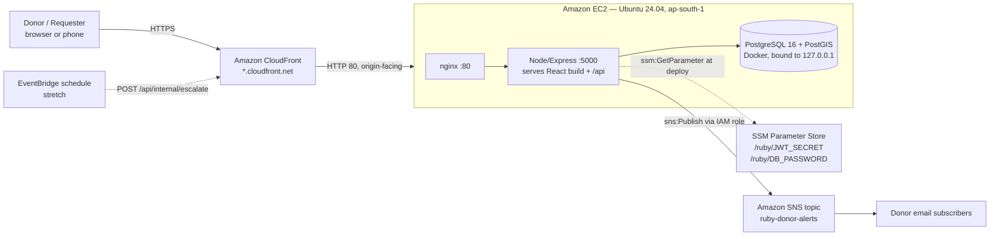

# SmartBloodConnect (Ruby)

Emergency blood donor matching and coordination — built on AWS.

> **Medical disclaimer:** Ruby does not medically clear donors and does not guarantee transfusion safety. Final donor eligibility and blood compatibility must be verified by qualified healthcare professionals or blood banks.

---

## The problem

Emergency blood requests in India still travel by phone calls and WhatsApp forwards — wrong blood group, wrong city, nobody knows who already donated. Ruby puts a deterministic matching engine in front of that chaos: a requester submits a blood type and hospital, the system finds compatible nearby donors and alerts them in priority-scored batches, and donor contact details are only revealed after the donor explicitly accepts.

---

## Live demo

| URL | `https://<your-cloudfront-id>.cloudfront.net` |
|---|---|
| Demo password | `Password123!` |
| Requester account | `asha@ruby.demo` (B+, near HITEC City) |
| Donor account | `dev@ruby.demo` |
| Admin account | `admin@ruby.demo` |

---

## AWS Architecture



### Services used and why

| AWS service | Why it was chosen |
|---|---|
| **EC2** | Runs the existing Node + PostgreSQL app unchanged. Fastest path for an SQL-based app with relational joins everywhere. |
| **CloudFront** | Free HTTPS URL without owning a domain. Browser geolocation (used for donor and hospital location) only works on HTTPS. |
| **SNS** | Out-of-app donor alerts. One publish, any number of subscribers — email now, SMS or push later. Subscribers can filter by `bloodGroup` and `urgency` message attributes. |
| **SSM Parameter Store** | Secrets outside git and outside the instance image. Free for standard parameters. No access keys on the box. |
| **IAM role on instance** | Least privilege: `sns:Publish` on one topic ARN only; `ssm:GetParameter*` on `/ruby/*` only. No long-lived credentials. |
| **AWS Budgets** | Cost guardrail — USD 5 alert with email before the first deploy. |
| **EventBridge** *(stretch)* | Auto-escalate to the next donor batch when nobody accepts, without polling from the client. |

### Architecture decisions and trade-offs

- **PostgreSQL in Docker on EC2 instead of RDS.** The app uses SQL repositories with joins on users, donor_profiles, matches, and requests. Migrating to DynamoDB would take days. RDS is cleaner but adds setup risk and cost for a hackathon. Listed as stretch: swap `DATABASE_URL` and set `DATABASE_SSL=true` with no other code change.
- **One EC2 instance, no autoscaling.** Sufficient for a demo. Scaling path: RDS + ALB + Auto Scaling Group, or ECS Fargate.
- **CloudFront in front of EC2** for HTTPS and a stable URL. `/api/*` caching is disabled so every API call reaches the origin.
- **SNS email for demo.** SMS to Indian numbers requires DLT sender registration; email subscriptions are confirmed in seconds.

---

## Before the event vs built during the event

This project uses a pre-existing React + Node + PostgreSQL codebase. The hackathon work was the AWS integration and deployment layer.

### Existed before the event
- React + Vite client
- Node.js + Express API server
- PostgreSQL schema (migrations in `server/migrations/`)
- Matching algorithm: compatibility, distance, radius expansion, priority scoring
- In-app notification records and accept/decline workflow
- JWT authentication, bcrypt, Helmet, rate limiting, CORS
- Demo seed data (`server/seeds/demo.sql`)
- Local Docker Compose setup

### Built during the event (this weekend)
| What | File(s) |
|---|---|
| SNS donor alert service | `server/src/services/alertService.js` |
| SNS hook in notification flow | `server/src/services/notificationService.js` |
| Unit tests for the alert service | `server/src/tests/alertService.test.js` |
| `trust proxy` for CloudFront + nginx | `server/src/app.js` |
| Hardened `docker-compose.yml` (loopback bind, secrets from env) | `docker-compose.yml` |
| Full `deploy/` folder | `deploy/bootstrap.sh`, `deploy/render-env.sh`, `deploy/deploy.sh`, `deploy/ruby.service`, `deploy/nginx.conf` |
| Teardown runbook | `deploy/TEARDOWN.md` |
| This README | `README.md` |

---

## Deployment

### Prerequisites (AWS console, one-time)
1. **AWS Budgets** — create a USD 5 alert with email.
2. **SSM SecureString parameters** in `ap-south-1`:
   - `/ruby/JWT_SECRET` — `openssl rand -hex 32`
   - `/ruby/DB_PASSWORD` — any strong password
3. **SNS topic** `ruby-donor-alerts`; add 2–3 email subscriptions; confirm each link.
4. **IAM role** `ruby-ec2-role` — inline policy: `sns:Publish` on the topic ARN + `ssm:GetParameter*` on `arn:aws:ssm:ap-south-1:<acct>:parameter/ruby/*`.
5. **Security group** `ruby-sg` — SSH from your IP only; HTTP 80 from CloudFront prefix list `com.amazonaws.global.cloudfront.origin-facing`.
6. **EC2** — Ubuntu 24.04, Free Tier eligible type (t3.micro or t2.micro), 20 GB gp3, role attached, add 2 GB swap if RAM is 1 GB.

### First deploy (on the instance)
```bash
# 1. Clone and bootstrap
git clone https://github.com/your-org/SmartBloodConnect /opt/ruby/app
sudo bash /opt/ruby/app/deploy/bootstrap.sh

# 2. Write /opt/ruby/.env from SSM
CLIENT_ORIGIN=http://placeholder \
SNS_TOPIC_ARN=arn:aws:sns:ap-south-1:<acct>:ruby-donor-alerts \
sudo bash /opt/ruby/app/deploy/render-env.sh

# 3. Pull deps, build client, start containers, run migrations, start Node
bash /opt/ruby/app/deploy/deploy.sh

# 4. Install nginx site and systemd unit
sudo cp /opt/ruby/app/deploy/nginx.conf /etc/nginx/sites-available/ruby
sudo ln -sf /etc/nginx/sites-available/ruby /etc/nginx/sites-enabled/ruby
sudo rm -f /etc/nginx/sites-enabled/default
sudo nginx -t && sudo systemctl reload nginx

sudo cp /opt/ruby/app/deploy/ruby.service /etc/systemd/system/
sudo systemctl daemon-reload && sudo systemctl enable --now ruby

# 5. Smoke test
curl http://localhost/api/health
# → {"status":"ok","mode":"database","database":"connected"}

# 6. Seed demo data (ONCE only)
set -a; . /opt/ruby/.env; set +a
cd /opt/ruby/app/server && NODE_ENV=development npm run seed
```

### Set up CloudFront and finalize
1. Create CloudFront distribution — origin: EC2 public DNS, HTTP 80. Viewer protocol: redirect to HTTPS. Methods: all. Cache policy: `CachingDisabled`. Origin request policy: `AllViewerExceptHostHeader`.
2. Once deployed, update `CLIENT_ORIGIN` in SSM or re-run `render-env.sh` with the real URL, then `sudo systemctl restart ruby`.

### Subsequent deploys
```bash
bash /opt/ruby/app/deploy/deploy.sh
```

### Logs
```bash
journalctl -u ruby -f
```

### Teardown
See [`deploy/TEARDOWN.md`](deploy/TEARDOWN.md) for the ordered resource deletion checklist.

---

## Local development

### Requirements
- Node.js 20+
- Docker Desktop

```bash
# Install all dependencies
npm run install:all

# Copy and configure local env
copy .env.example server\.env
# Edit server/.env: set JWT_SECRET, DATABASE_URL, etc.

# Start PostgreSQL
docker compose up -d

# Run migrations and seed demo data
npm run migrate
npm run seed

# Start both client and server in watch mode
npm run dev
```

Frontend: `http://localhost:5173`  
Backend health: `http://localhost:5000/api/health`

### Demo mode (no database needed)
```env
# server/.env
DEMO_MODE=true
JWT_SECRET=local-demo-secret
CLIENT_ORIGIN=http://localhost:5173
PORT=5000
```
Then `npm run dev`. Data resets on every server restart.

---

## How matching works

When a blood request is created, Ruby:

1. Validates the request and required-by time.
2. Resolves compatible RBC donor blood groups.
3. Filters donors: inactive accounts, unavailable status, stale GPS location, duplicate pending match, donation recency within 56 days.
4. Calculates Haversine distance from donor area to hospital.
5. Expands search radius through 5 → 10 → 20 → 30 km until enough candidates are found.
6. Scores each candidate 0–100 on: distance (40%), recency (30%), reliability (20%), urgency fit (10%).
7. Stores matches and notifies the top batch via in-app notifications and SNS email alert.

Candidate Priority Score is an operational contact priority only — not a measure of medical compatibility or safety.

---

## Testing

```bash
cd server && npm test
```

Test suites: blood compatibility · distance calculation · priority scoring · eligibility rules · SNS alert service (mocked).

---

## Security and privacy

- Passwords stored as bcrypt hashes only.
- `JWT_SECRET` must be 32+ characters and not a documented default; server refuses to start otherwise.
- API: Helmet security headers, CORS origin check, JSON size limit (1 MB), rate limiting (300 req / 15 min).
- Donor exact coordinates and contact details are **never** revealed to the requester until the donor explicitly accepts.
- SNS alert messages contain blood group, hospital name, urgency, and approximate distance only — no donor coordinates, phone, or email.
- No AWS access keys on the EC2 instance; all AWS calls use the instance IAM role.
- Port 5432 (PostgreSQL) is bound to loopback only and never exposed to the internet.
